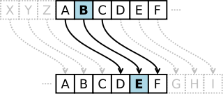
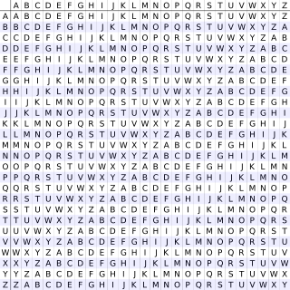

# Criptografia

> Criptografia (em grego: kryptós, "escondido", e gráphein, "escrita") é uma área da criptologia que estuda e prática princípios e técnicas para comunicação segura na presença de terceiros, chamados "adversários". Mas geralmente, a criptografia refere-se à construção e análise de protocolos que impedem terceiros, ou o público, de lerem mensagens privadas. Muitos aspectos em segurança da informação, como confidencialidade, integridade de dados e autenticação são centrais à criptografia moderna. A criptografia moderna existe na interseção das disciplinas de matemática, ciência da computação, engenharia elétrica, ciência da comunicação e física. Aplicações de criptografia incluem comércio eletrônico, cartões de pagamento baseados em chip, moedas digitais, senhas de computadores e comunicações militares.

## Cifra de Substituição

Em criptografia, uma cifra de substituição é um método de criptografia que opera de acordo com um sistema pré-definido de substituição. Para criptografar uma mensagem, unidades do texto
( que podem ser letras isoladas, pares ou outros grupos de letras ) são substituídas para formar a cifra. As cifras de substituição são decifradas pela substituição inversa.

Podemos citar como uma das mais antigas e simples formas de codificar informações a cifra de **Atbash**, consiste em uma simples substituição do alfabeto, apenas troca a primeira letra pela ultima, a segunda pela penúltima e assim por diante, invertendo o alfabeto usual.

```
Normal:  a b c d e f g h i j k l m n o p q r s t u v w x y z
Código:  Z Y X W V U T S R Q P O N M L K J I H G F E D C B A
```

## ROT - 13

Podemos citar como uma das mais simples cifras de substituição a ROT-13, seu nome vem do inglês: "ROTate by 13 places" ou "ROTacionar 13 posições", vamos deslocar cada letra da mensagem cifrada em 13 posições a frente

Ex: HELLO —> URYYB

## Cifra de Cesar

Também é uma cifra de substituição, porém é um pouco mais elaborada que o ROT-13, segue basicamente o mesmo conceito, porém não se limita a um deslocamento de apenas 13 posições, pode variar em qualquer deslocamento dentro do alfabeto, no caso 26 possibilidades



## Cifra de Blaise

A cifra de Blaise é um método de criptografia que usa uma série de diferentes cifras de César baseadas em letras de uma senha, é bem similar porém os deslocamentos são de acordo com a palavra usada como chave, durante cerca de 300 anos foi tida como a "cifra inquebrável", mas hoje pode ser facilmente analisada e decifrada



## Cifra de Palavra-Chave

Uma cifra de palavra-chave é uma forma de substituição monoalfabética . Uma palavra-chave é usada como chave e determina as correspondências de letras do alfabeto cifrado com o alfabeto simples. Repetições de letras na palavra são removidas, então o alfabeto cifrado é gerado com a palavra-chave correspondendo a A, B, C etc. até que a palavra-chave seja usada completamente, removemos as letras repetidas e no restante do texto cifrado são usadas as letras em ordem alfabética, excluindo aquelas já usado na chave.

```bash
Texto simples: A B C D E F G H I J K L M N O P Q R S T U V W X Y Z
Criptografado: S E G R D O A B C F H I J K L M N P Q U T U V W X Z

Usamos essa correspondência para cifrar a mensagem
```

## Cifra de Transposição

Diferente das cifras de substituição, nesse caso nós não vamos substituir os caracteres de uma mensagem por outro seguindo uma regra, vamos apenas tomar os próprios caracteres e embaralhar seguindo um padrão, em alguns casos, até adicionamos alguns para dificultar para o analista, abaixo seguem exemplos de cifras de transposição

## Cifra de Colunas

Nessa cifra, vamos escrever o nosso texto na forma de colunas verticais e depois vamos ler na horizontal, e para decifrarmos faremos o caminho inverso, como no exemplo

C  P  G  F      Lemos como: CPG FRT RII OAA
R  T  R   I
I   O  A   A      Texto Real: CRIPTOGRAFIA

## Transposição de Colunas

Nesse tipo de cifra faremos um processo similar ao anterior, porém usaremos uma chave no cabeçalho e usamos isso para saber a ordem de enviar a mensagem e de decriptar

F  A  T   O
C  R  I   P      Lemos como: ROF CTA PRA IGI
T  O  G  R
A  F   I   A       Texto Real: CRIPTOGRAFIA

## Bônus: Cifra de Bacon

Essa pode não ser considerada uma cifra de substituição propriamente dita, podemos encaixá-la em uma categoria de Esteganografia, pois não codificamos a mensagem de fato, pois a mensagem final ainda será legível, porém a grafia das letras será alterada, fazemos as substituições de acordo com as tabelas abaixo

A cifra de 24 letras: É a original. Nela, os pares de caracteres (I,J) e (U,V) não possuem distinção

```bash
A = aaaaa  I/J = abaaa    R = baaaa
B = aaaab    K = abaab    S = baaab
C = aaaba    L = ababa    T = baaba
D = aaabb    M = ababb  U/V = baabb
E = aabaa    N = abbaa    W = babaa
F = aabab    O = abbab    X = babab
G = aabba    P = abbba    Y = babba
H = aabbb    Q = abbbb    Z = babbb
```

A cifra de 26 letras: A segunda versão da cifra. Agora todas as letras possuem um código único.

```bash
A = aaaaa  I = abaaa  Q = baaaa  Y = bbaaa
B = aaaab  J = abaab  R = baaab  Z = bbaab
C = aaaba  K = ababa  S = baaba
D = aaabb  L = ababb  T = baabb
E = aabaa  M = abbaa  U = babaa
F = aabab  N = abbab  V = babab
G = aabba  O = abbba  W = babba
H = aabbb  P = abbbb  X = babbb
```


Feito por [Gabriel Matheus Santos de Jesus](https://github.com/gmsj)